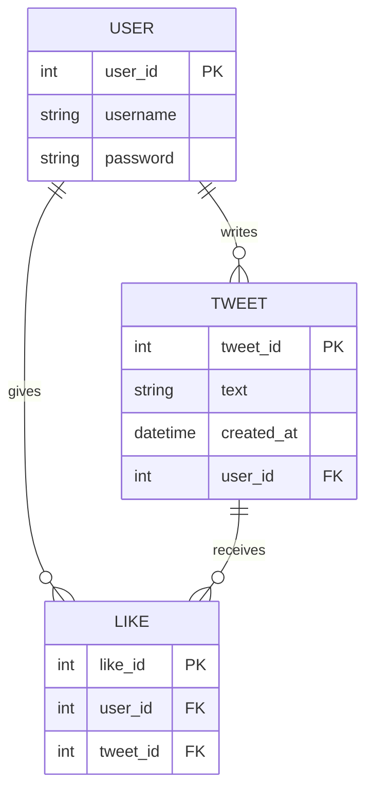

# Mini-Twitter-App

A full-stack "mini-twitter" application built with **TypeScript**, **Node.js (Express)** and **SQLite**.

This project demonstrates core concepts of **Object-Oriented Programming (OOP)**, REST APIs, and basic full-stack architecture.

---

# Tech Stack

* **Frontend:** HTML, CSS, TypeScript
* **Backend:** Node.js + Express (TypeScript)
* **Database:** SQLite
* **Containerization (planned):** Docker (Dockerfile & Compose prepared)

---

# Quick Start

Make sure Node.js is installed.

Run the development server:

```bash
npm run dev:server
```

---

# Features

* User registration & login (JWT authentication)
* Create and delete tweets
* View timeline/feed
* Like tweets (concept implemented in data model)
* REST API backend
* Docker setup prepared (currently inactive)

---

# Architecture Overview

The application follows a classic **3-layer architecture**:

1. **Frontend** – User interface and interaction
2. **Backend (API)** – Business logic and request handling
3. **Database** – Persistent data storage

Communication happens via a **REST API** between frontend and backend.

---

# OOP Concept

The application is structured using **Object-Oriented Programming** principles.

## Main Classes

* **User**

  * Properties: id, username, password
  * Responsibilities: authentication, managing user data

* **Tweet**

  * Properties: id, text, createdAt, userId
  * Responsibilities: representing and managing posts

* **Like**

  * Properties: id, userId, tweetId
  * Responsibilities: connecting users and tweets

## Why OOP?

OOP was used to:

* Represent real-world entities (User, Tweet)
* Encapsulate logic inside classes
* Improve code structure and maintainability

---

# UML ()


# ERD (Entity Relationship Diagram)



## Explanation

* A **User** can create multiple **Tweets** → (1:n)
* A **User** can like multiple **Tweets**
* A **Tweet** can receive multiple **Likes**

This results in a **many-to-many relationship** between User and Tweet, resolved through the **Like** entity.

---

# How the App Works

1. A user logs in or registers
2. The frontend sends a request to the backend API
3. The backend processes the request and interacts with the database
4. Data is returned and displayed in the frontend

Example:

* User creates a tweet → POST request → backend → database → response → UI updates

---

# Future Improvements

* Full Like functionality implementation
* Comments feature
* Improved UI/UX
* Activate Docker setup

---

# Notes

This project was developed as part of an OOP-focused module and demonstrates both:

* Practical software architecture
* The application of object-oriented design principles in a real project

